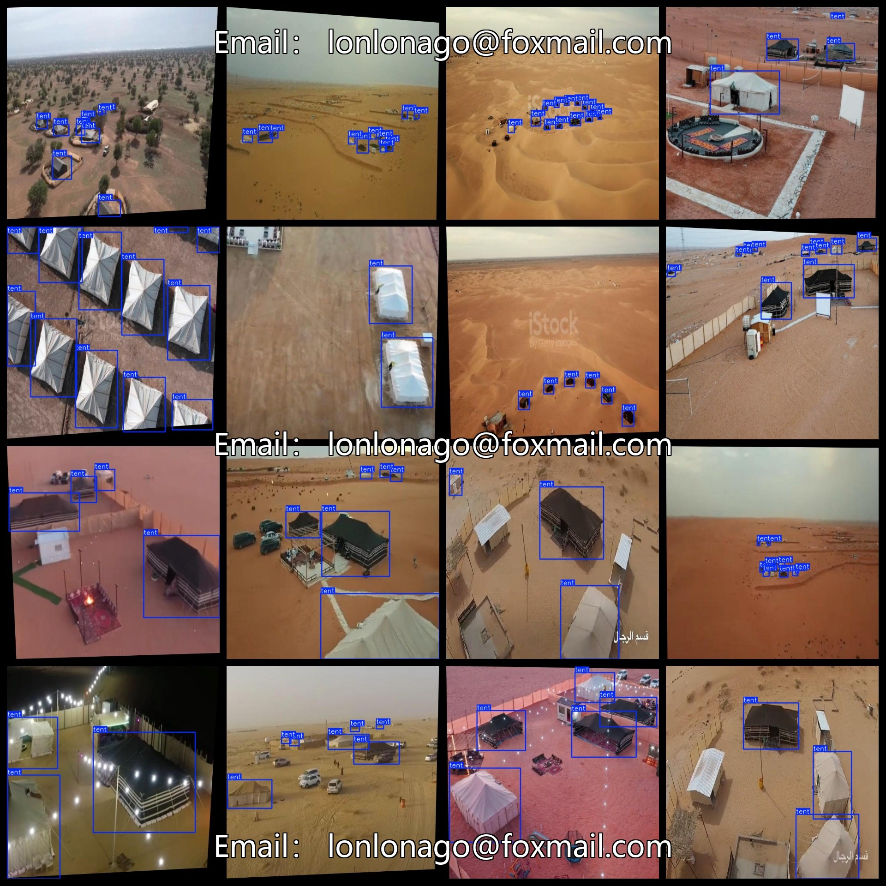

# UAV View Aerial Tent Yurt Dataset 2054 imagesVOC+YOLO format

The UAV View Aerial Tent Yurt Dataset is a collection of 2054 images in the VOC+YOLO format, including Pascal VOC and YOLO. The dataset does not include txt files with split paths, but only contains jpg images along with corresponding VOC and YOLO format xml files and txt files.

Number of images (jpg file count): 2054

Number of annotations (xml file count): 2054

Number of annotations (txt file count): 2054

Number of annotation categories: 1

Repository: datasets_sl

Annotation category name: ["tent"]

Box counts for each category:

- "tent" box count = 10563
- Total box count = 10563
- Number of images per category:
- "tent" per category images = 2054
- Image resolution: 640x640

Annotation tool used: labelImg

Dataset enhancement status: No

Annotation rules: Draw boxes around classes

Important note: The dataset does not contain any split into training, validation, or test sets; it requires custom division.

Special declaration: This dataset does not guarantee the accuracy of the trained model or weight files.

Annotation and image details are as follows:

## Images

---

Here is a pay link on Stripe (https://buy.stripe.com/3cs8yP7sY87d0vu9AB). Please contact me lonlonago@foxmail.com after funding $89, and I will send you a complete data files, thank you!

